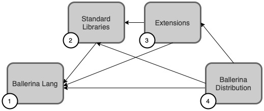

# Ballerina Library Build and Release Guide

_Authors_: @niveathika @ThisaruGuruge
_Reviewers_: @shafreenAnfar @daneshk @NipunaRanasinghe
_Created_: 2022/07/05
_Updated_: 2024/04/29

## Table of Contents

- [Overview](#overview)
- [Build Process](#build-process)
- [Branching Strategy](#branching-strategy)
  - [Branch Naming](#branch-naming)
- [Handling Essential Breaking Changes](#handling-essential-breaking-changes)
  - [Steps to merge Essential Changes](#steps-to-merge-essential-changes)
- [Release Process](#release-process)
  - [Single module release](#single-module-release)
  - [Multiple module release](#multiple-module-release)

## Overview

This guide explains the build and release process of the Ballerina Library packages. The goal is that everyone in the team should be able to release any Ballerina package with the help of this guide.

## Build Process

Ballerina distribution depends on multiple components.

Standard Libraries are built on top of the base Ballerina Language distribution.

The build includes the following tasks,

1. Create an intermediate Ballerina Distribution consisting of Language and any dependent Ballerina library package.
2. Build and Run unit tests.
3. Create an intermediate distribution, including the module.
4. Run any Integration Tests or Compiler Plugin Tests.
5. Publish the module to GitHub Packages.

The [Gradle Plugin](https://github.com/ballerina-platform/plugin-gradle) executes tasks 1, 2 and 3. This plugin includes all build, test and publish tasks of the Ballerina library packages to Ballerina Central. Publish of Ballerina module or native components depend on GitHub packages.

## Branching Strategy

The Ballerina library branches are intended to maintain a releasable state all the time. The default branch of the repository _should_ be the latest release branch. Patch branches are used to do patches on top of a given distribution version.

### Branch Naming

The Branch naming convention is as follows.

1. There is a default branch for each repository, named either `master` or `main`.
2. For each distribution release, there _should_ be a patch branch names `<distribution-major-version>.<distribution-minor-version>.x`

    E.g.:
    - 2201.1.x
    - 2201.2.x
    >**Note:** Even though this is not a necessity, it is advised to maintain these patch branches, as it will be easier to do patches on top of a given distribution version and to run the full build pipelines.
3. When there is an ongoing release for a distribution version, a branch named `next-release` should be created to merge the new features that are planned to release with the next release. Once the release is done, the `next-release` branch should be merged to the default branch.

## Version Strategy

All the Ballerina Standard Libraries _must_ follow [semver versioning](https://semver.org/).

Excerpt from semver:

> Given a version number MAJOR.MINOR.PATCH, increment the:
>
> - MAJOR version when you make incompatible API changes
> - MINOR version when you add functionality in a backward compatible manner
> - PATCH version when you make backward compatible bug fixes

### Release Scenarios

A Ballerina library module can be released in the following scenarios.

- A new feature is added to the module.
- A bug fix is added to the module.
- A dependent module is released with a new feature.

>**Note:** When a dependent Ballerina library package is having a minor version bump, all the dependents _must_ bump to the next minor version with the updated dependency versions.

For example, consider the following scenario:

- The `ballerina/io` is released with `1.0.0` version
- The `ballerina/log` is depending on `ballerina/io` and also released `1.0.0` version
- The `ballerina/http` is depending on `ballerina/log` and also released `1.0.0` version

### Case 1: Dependent Module Released a Patch Version

If the `ballerina/io` is released the `1.0.1` version, the `ballerina/log` or the `ballerina/http` module does not need to update the dependencies. (Although it is _recommended_ to update to the patch version, there's no issue even if it is not updated since the Ballerina package resolution will automatically resolve the latest patch version).

### Case 2: Dependent Module Released a Minor Version

If the `ballerina/io` is released the `1.1.0` version, the `ballerina/log` module should update the `io` version in the default branch to `1.1.0` and release the `1.1.0` (the next minor version) of the `ballerina/log` module. Then the `ballerina/http` _must_ release the `1.1.0` version with the updated `ballerina/io` and `ballerina/log` dependencies. This is to ensure that there are no version conflicts occurring in the `ballerina-distribution` and the next Ballerina release.

## Handling Essential Breaking Changes

The module, with a dependency on an older Language Distribution, will function on newer versions as long as there are no Essential Breaking Changes from the Language team for the upcoming Ballerina Update release.
> Essential Changes cannot be added in Patch Releases.

Compiler Team will handle all Essential Changes proactively. We have added a Pull Request check to all `ballerina-lang` Pull Requests. It is to validate that no downstream Ballerina library modules are impacted.

[Build Pipelines Workflow](https://github.com/ballerina-platform/ballerina-release/actions/workflows/daily-full-build-master.yml) will build all Standard Libraries using the latest Language  version(for the specific update). It will send a notification if there are any build breaks. Module owners should address any failure notification promptly. Since Compiler Team handles the Essential Changes proactively, the builds should not fail for more than a day.

### Steps to Merge Essential Changes

1. Language Team developer will work on the feature in an upstream branch.
2. Run Full Build Pipeline Workflow to identify impacted modules.
3. Open an issue in `ballerina-standard-library` containing the details of the changes and the impacted modules list.
4. Module owners will migrate to the provided version in an upstream feature branch,
    - Cut the branch for lower lang dependency(2201.2.x).
    - Migrate the code to the latest language dependency.
    - Change the distribution in Ballerina.toml.
    - Bump to the next minor version (Skip this step if the development version is the next minor version to the last release)
5. Update the `ballerina-distribution` with the timestamp versions of the impacted modules.
6. Developer opens a `ballerina-lang` PR and merges the change.
   - If the ballerina-lang changes are needed for the module build to pass:
     - The ballerina-lang developer should provide the Language timestamped version to module owners after publishing the lang
     - Then the Ballerina library developers should update the lang version to the timestamped version and do the fixes on top
   - If the ballerina-lang changes are _not needed_ for the module build to pass:
     - The module developer can do the fix and merge it to the default branch
     - The ballerina-lang developer can check the build workflow to check whether there are more failures in the Ballerina library. If there are no more breaking modules, they can merge their fixes

## Release Process

### Single Module Release

With the current design of Central, any stand library can be released at any time if the module owner and the lead deem it necessary. Module owners need not wait and synchronize with distribution release dates.

[Publish GitHub Workflow](https://github.com/ballerina-platform/module-ballerina-http/actions/workflows/publish-release.yml) is used to release the module .

Checklist for the release,

1. All unit and integration tests are passing.
2. The module does not include any components with an identified Security Vulnerability.
3. Publish artifact to the [Central Staging Environment](https://github.com/ballerina-platform/module-ballerina-http/actions/workflows/central-publish.yml). Select the `STAGE CENTRAL` option in the workflow.
4. Run [workflow](https://github.com/ballerina-platform/ballerina-standard-library/actions/workflows/test_stdlib_releases_with_staging.yml) to verify that the newly published module is working in an integration scenario. (This is to ensure the Ballerina library release will not break the existing users' build)
5. Run the release workflow.
6. Publish artifact to the [Central Dev Environment](https://github.com/ballerina-platform/module-ballerina-http/actions/workflows/central-publish.yml). Select the `DEV CENTRAL` option in the workflow.
7. Update module version in Ballerina Distribution in the corresponding patch branch.
8. Merge the automated post-release pull request in the respective module repo to the corresponding patch branch (E.g.: If the release is done on top of the 2201.3.x branch, change the pull request base to 2201.3.x branch and then merge the PR).

### Multiple Module Release

The Ballerina Library Release Manager will use [Stdlib Release Workflow](https://github.com/ballerina-platform/ballerina-library/actions/workflows/release_pipeline.yml) to release multiple modules(Usually during Ballerina Update releases). It will publish all modules in the [list](https://github.com/ballerina-platform/ballerina-library/blob/main/release/resources/stdlib_modules.json). The Release Manager can override it by using the `release` property.

#### Release Checklist

1. Create a sheet to track the modules to be released. The sheet should contain the following details,
    - Level
    - Module
    - Need Lang Latest
    - Timestamped Version or Latest Released Version (Refer [Release Scenarios](#release-scenarios) section for information)
    - Distribution Version

    Along with these columns, the latest lang timestamped version and the latest distribution version should be added. Optionally, the `observe` and `observei` versions should be added for reference.
2. Communicate with the module owners to update the sheet incrementally from level 1 onwards.
    - If the module is releasing with the distribution:
      - The module owner should update
        - The module version, dependency version, and the lang version in the `gradle.properties` file
        - The distribution version in the `Ballerina.toml` file

        and send a PR to the respective repo.
      - Once the PR is merged and the build is passed, the module owner should update the sheet with the timestamped version
      - The dependent modules should use the timestamp versions of the dependencies
    - If the module is not releasing with the distribution:
      - The module owner should update the sheet with the latest released version

3. The Ballerina library release manager uses the [Extensions - Update Ballerina Version Workflow](https://github.com/ballerina-platform/ballerina-release/actions/workflows/update_dependency_version.yml) to update dependency versions to the latest for consecutive version updates if any (lang RC releases).
    - If the RM is releasing only a subset of modules, which have the latest Language version, they should update the [extensions.json](https://github.com/ballerina-platform/ballerina-release/blob/master/dependabot/resources/extensions.json) by removing unnecessary modules in a separate branch. They can run the workflow run on said branch
    - Do not remove `ballerina-distribution` from the [extensions.json](https://github.com/ballerina-platform/ballerina-release/blob/master/dependabot/resources/extensions.json). If removed, the workflow will not update latest stdlib versions in `ballerina-distribution` in master branch
4. Ensure Ballerina Release Manager has released all modules to the Central Staging after each RC vote. The release Manager of the Ballerina Release will publish this. Module owners are responsible for the ballerinax components.
5. The Ballerina library release manager runs the [stdlib test workflow](https://github.com/ballerina-platform/ballerina-library/actions/workflows/test_stdlib_releases_with_staging.yml) to verify newly published modules are working in an integration scenario. (This is to ensure no Ballerina library release will break the existing users' build)
6. Once the final RC pack is passed the voting phase, update the [module list](https://github.com/ballerina-platform/ballerina-standard-library/blob/main/release/resources/stdlib_modules.json) to reflect the modules to be released.
   >**Note:** If a module is not releasing with the given distribution release, change the `release` property to `false` in the module list. (This can be done on a separate branch and that branch can be used to trigger the release workflow.)
7. Once the module list is updated, notify the team to refrain from merging any PRs to the default branches, including the post-release PRs.
8. Create a separate branch in the `ballerina-library` repo related to the release and, update the `stdlib_modules.json` file by either setting the `release` property to `false` or completely removing the entries for the modules that don't need to be released.
9. Then the release manager can trigger the [Library Release Workflow](https://github.com/ballerina-platform/ballerina-library/actions/workflows/release_pipeline.yml) to trigger the release.
    This workflow expects the following inputs:
    - `release_libs`: To release the library (`module-ballerina-*` modules that are packed with the distribution) modules. These modules are listed under the `modules` field in the `module_list.json` file. The default value is `true`.
    - `release_extensions`: To release the ballerina extended (`module-ballerinax-persist.*`, and `copybook`) modules. These modules are listed under the `extended_modules` field in the `module_list.json` file. The default value is `false`.
    - `release_tools`: To release the ballerina tools (`*-tool`) modules. These modules are listed under the `tools` field in the `module_list.json` file. The default value is `false`.
    - `release_connectors`: To release the ballerina connectors (`module-ballerinax-*`) modules. These modules are listed under the `connectors` field in the `module_list.json` file. The default value is `false`.

    > **Note:** The release manager should update the `release` property in the module list (stdlib_modules.json) to `false` for the modules that are not releasing with the distribution release before triggering the workflow.

10. The workflow logs will show the current status of the release. The release manager should monitor the workflow and take necessary actions if any failures occur.

    - If a particular module release is failed, the Ballerina library release manager should check the logs and take necessary actions to fix the issue.
      - If the issue is related to the module, inform the module owner to fix the issue and inform the release manager.
      - If the issue is an intermittent issue (GitHub issue, network issue, etc.), the release manager can manually trigger the release workflow for the failed module.
      - If the module is already released to the Ballerina central, and the GitHub release is failed after creating the tag, the release manager can manually create the GitHub release.
    - Once the failed module is released, the Ballerina library release manager can re-trigger the Library Release Workflow to continue the release. There's no need to update the module list.

       >**Note:** If a post-release sync PR is merged before the release is completed, re-triggering the workflow may result in a re-release of the module.
11. Once the release workflow is complete, update the corresponding branch in the `ballerina-distribution` repo with the released module versions. Then inform the release manager to continue the distribution release process.
12. Once the distribution release process is completed, notify the team to update the changelogs and merge the post-release PRs to the default branches.
