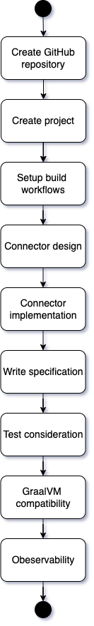

# Connector Development Process

# Library Development Process 
_Authors_: @shafreenAnfar @ThisaruGuruge @NipunaRanasinghe @niveathika @TharmiganK    
_Reviewers_: @daneshk @ThisaruGuruge @NipunaRanasinghe  
_Created_: 2024/04/17   
_Created_: 2024/04/17   

## Overview

This section discusses the connector development process from inception to realization. The goal is to ensure we deliver the best possible connector experience. The sequence of each step might be adjusted slightly, but the overall process remains unchanged. Once a library completes each step and reaches the end, we can designate it as a generally available connector. Each connector owner is responsible for ensuring their libraries undergo these steps before signing off.

## Naming Convention

This section introduces the naming conventions you need to be aware of before starting the development of connectors.

### Package
The connector name should use lowercase letters and be descriptive of the service or API it interacts with.

### Submodules
Subpackages should be named in lowercase letters and should reflect the sub-functionality they contain.

### Hierarchical naming

In Ballerina, the package name can be hierarchical, and the submodules can also be nested hierarchically to create a logical structure. Here are some examples of hierarchical packages and submodules:

Hierarchical Packages:
- ballerinax/azure.cosmosdb
- ballerinax/openai.chat

Hierarchical Submodules within a Package:
- ballerinax/salesforce.commons

### Hierarchical Packages vs. Submodules

#### Hierarchical Packages
Hierarchical package names are preferred when there is a need to distinguish between connectors related to the same vendor/provider. For example, the separation between `azure.eventhub` and `azure.servicebus` can be achieved through hierarchical packages, making it clear that these two are related to the same provider, yet they represent distinct services. It's also recommended to have multiple packages with hierarchical naming when dealing with multiple APIs related to the same SaaS product having independent versioning and release cycles. For example, Salesforce supports multiple APIs having independent API versioning. Therefore, it is recommended to have multiple connectors, each in its separate hierarchical package:

- ballerinax/salesforce.bulk
- ballerinax/salesforce.soap

#### Submodules
Submodules should primarily be used to organize the code structure within a single connector package. Avoid defining multiple sub-clients in each submodule within a single connector package, as this may lead to code ambiguity and complexity.

### Vendor/Platform Prefixes

#### Generic SaaS Product Names
When dealing with SaaS product names that are more generic and not specific to a particular vendor, it is recommended to add a vendor/platform abbreviation as a prefix to the package name. This helps to distinguish the client usages and avoid ambiguity, especially when multiple vendors offer similar services. For example, Azure provides storage services. In this case, using a vendor/platform abbreviation as a prefix is advisable:

- ballerinax/azure.azstorage

#### Vendor-Specific Names
If the SaaS product name is specific to a particular vendor and is unlikely to cause conflicts or confusion with other connector usages in the same program, there may be no need to prefix the package name with a vendor/platform abbreviation. For example, Azure provides CosmosDB. In this case, using the connector as ‘cosmosdb:Client’ is less likely to create conflicts or confusion with other connectors:

- ballerinax/azure.cosmosdb

#### Summary
In summary, the decision to add a vendor/platform abbreviation as a prefix to the package name should be handled on a case-by-case basis, considering the specificity of the SaaS product name and its potential for conflicts or confusion.

### Best Practices

#### Clarity and Readability

Package names should be clear and descriptive, making it easy for developers to understand the purpose of each package and module. Good package names are typically short, clear, and comprised of simple nouns.

Despite being syntactically correct, some naming patterns that are typical in other languages might not be idiomatic in Ballerina. For example, consider the following package names, which may be recommended in other languages but do not fit well in Ballerina:

- azureEventHub
- azure_event_hub

It is acceptable to use abbreviations as the package name if the abbreviation is more familiar among the developer community. Most widely-used packages often have compressed names. However, using any cryptic abbreviations or overly generic names should be avoided.

#### Consistency

Maintain consistency in naming throughout the connector. Consistency promotes a unified and intuitive experience for developers using the connector.

#### Avoiding Overly Deep Hierarchies

While nesting subpackages can be useful for organization, avoid creating overly deep hierarchies. Packages should provide a logical structure without becoming excessively complex.

#### Avoiding Split-Module Conditions

A “split-module condition” can occur when the latest versions of two different packages contain the same module, resulting in a build failure. Therefore, hierarchical structures should be chosen carefully and used with caution to minimize such situations. (Refer to [Ballerina package references documentation](https://ballerina.io/learn/package-references/#the-split-module-condition) for more details).

## Development process

The development process can be broken down into two main parts: REST API connectors and other types of connectors. The following sections explain each part in detail. Although there are two main parts, most steps in the development process remain the same.

    

### Create Github repository

For each connector, you must have a separate GitHub repository. The name of the repository should follow the pattern below, similar to any Ballerina library that you develop:

- module-ballerinax-\<connector-name>

Below are some examples of connector repositories:

- module-ballerinax-gmail
- module-ballerinax-salesforce
- module-ballerinax-zendesk

### Create project

Once you create the repository, you need to create the project structure of the repository. This project structure is the same as that of the Ballerina standard library. Presently, the library repositories comprise essential components, including:

- Ballerina source code,
- Examples, and
- Documentation (Spec and proposals).

Furthermore, some libraries incorporate supplementary components such as:

- Native code,
- Compiler plugin,
- Compiler plugin tests, and
- Integration tests (Ballerina tests residing in a separate package).

Based on the aforementioned components, it becomes evident that a given Ballerina library repository is not purely a Ballerina project; rather, it is a multifaceted project encompassing various components, with Ballerina package source code being one of them.

### Setup Build Workflows

In this initiative, we are tasked with managing over 100 Ballerina libraries, each with its own dedicated repository. The magnitude of these libraries necessitates the implementation of automated procedures for both building and releasing them. The existing Ballerina (Standard) Libraries rely on the following tools to facilitate this process:

- Gradle: Serves as the build tool
- GitHub Actions: Employed for CI/CD pipelines

#### Build and Release Automation

GitHub Actions serve as the backbone of these pipelines. However, a key distinction exists between the Ballerina and Ballerinax modules.

The Ballerina modules, bundled with ballerina-distribution, are constructed atop an intermediate Ballerina pack. This intermediate pack incorporates timestamped versions of ballerina-lang and other dependencies from the Ballerina Standard Library. This architectural choice aims to maintain build stability and promptly detect failures. GitHub packages serve as the platform for publishing these timestamped versions, enabling dependents to fetch and build their intermediate packs.

In contrast, the Ballerinax modules, destined to be pushed independently to Ballerina Central, do not have these dependencies. Therefore, it is recommended to use nightly builds for these types of modules. This approach offers the advantage of reduced resource consumption on GitHub packages, as we no longer need to publish the timestamp builds for them. The nightly pack can be obtained from the [Daily Build](https://github.com/ballerina-platform/ballerina-distribution/actions/workflows/daily-build.yml) in the `ballerina-distribution` repository.

## Connector Design

In many cases, it is possible to have a one-to-one mapping with the external service. For instance, if the external service is a REST service, it is expected that connector resource functions will be generated for each resource in the external service. It is not expected, however, that you design some resource functions by combining multiple external resources.

However, as an exception, in some cases, it is possible to have a different set of resource functions compared to what is available in the external system. In such cases, special reasoning must be provided to justify the effort.

Also, it is not expected that one connector can map to multiple different APIs, even within the same system. For instance, there are systems with multiple REST APIs, such as one for sales and another for finance. In such cases, there should be two independent connectors, as those two APIs are independent of each other and evolve independently. This also means that you shouldn’t create one connector package with multiple modules to represent each API.

## Connector Implementation

### REST API Connectors
When developing REST API connectors, the first step is to define an OpenAPI Specification (OAS). Ideally, the OAS should be retrieved from the external system to which the connector is being developed. It is not recommended to obtain OAS specifications from third-party providers.

Once the OpenAPI specification is retrieved, it needs to be validated for each operation because it is common for an OAS to be out of sync with the actual API. After the OAS is validated, it must be added to the GitHub repository. Adding the OpenAPI specification to the GitHub master repository signifies that you have validated the OAS and completed the required alterations.

The OAS must include an example request and response for each resource action. This will be used to generate mock clients and servers.

#### Generate Connector
When generating the connector using the OAS tool, you have two options: you can generate with resource functions or remote functions. Resource functions are preferred over remote functions. If you decide to generate remote functions, you must explain the reasoning behind this choice.

### Handwritten Connector
These types of connectors wrap some SDK with Ballerina code, such as the IBM MQ connector. For these connectors, it is not possible to generate code. Apart from that, there is no difference between handwritten connectors and generated connectors.

### Write Specification

You must write a specification for your connector. In the case of REST APIs, your specification can be the OAS (OpenAPI Specification). However, if you have made any alterations, or as we call them, sanitations, you must document them in sanitations.md. For a handwritten connector, a `spec.md` should be included describing the connector functionality.

### Test Consideration

The code we write for connectors differs significantly from the code we write for other modules. Most connectors are generated using the OpenAPI tool, and some are handwritten. Handwritten connectors usually wrap a given SDK to create the Ballerina version of it. Most of the time, the code required for this is very minimal, lacks a mutable state, and each operation is independent of the others.

>**Note:** Some handwritten connectors may include custom logic. In such scenarios, using tests to cover the custom logic and maintaining 80% coverage is a must.

With the above in mind, the following are the aspects covered by test cases:

- Validate the implementation against the contract (not common),
- Catch any regression issues (not common),
- Catch any breaking changes introduced by language changes (relatively common),
- Validate against platforms such as GraalVM, Java11, etc. (not common).

#### Need for Tests

Yes, tests are necessary due to the aforementioned reasons, but the main reason is to guard against language changes.

#### When to Run Tests

Tests should be conducted when doing a release or when there is a language change.

#### Required Environment

The goal here is to reduce external dependencies as much as possible, thereby reducing maintenance costs. Assuming that external services adhere to standard practices, our first priority would be to mock those backends. In other cases, we can use Docker images, and as a last resort, configure security tokens and connect to SaaS endpoints.

### GraalVM Compatibility

Since we have announced official support for GraalVM in Swan Lake Update 7, it is essential to ensure that the connectors are GraalVM compatible and to monitor this compatibility using daily builds. This has already been incorporated into the ballerina modules in the Standard Library repository.

When it comes to connectors, we can group them as follows to check GraalVM compatibility:

- Pure Ballerina connectors - These connectors depend only on Ballerina packages. Therefore, these connectors are explicitly GraalVM compatible only if all their dependencies are also GraalVM compatible.
- Other - These connectors have one or more direct Java dependencies. Therefore, it is required to verify GraalVM compatibility for these connectors and mark them as GraalVM compatible.

For more information, follow the [GraalVM Compatibility in Ballerina Libraries](https://github.com/ballerina-platform/ballerina-library/blob/main/docs/graalvm-compatibility-in-ballerina-libraries.md) guide.

## Observability

Once the connector is developed, it is important to check if it includes the appropriate metrics for Grafana and works well with Jaeger tracing. For HTTP-based connectors, this should already be in place, as they utilize the http:Client underneath. However, this may not be the case for other types of connectors. In such instances, it is important to add any missing metrics and tracing information.

