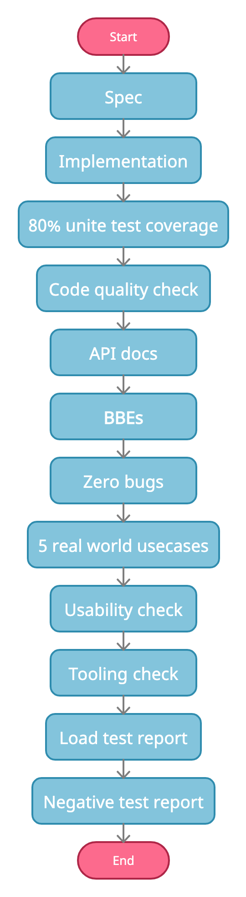

# Library Development Process 
_Author: Shafreen Anfar, Reviewer: Danesh Kuruppu, Created on: 2021/08/26, Last updated: 2021/08/26_ 

This section basically discusses the library development process from the inception to materializing it. The goal is to make sure we deliver the best possible library experience we could. The order of each step could be changed a bit but the overall process stays the same. Once a library goes to each step and reaches the end, we can sign it off as a general availability ready library. Each library owner is responsible for making sure their libraries go through these steps before signing off. 

The below section discusses each step of this process.

## Spec

Specification is basically a structured document which discusses the problem domain and how we are planning to solve those. Many libraries have a design doc which basically does the same thing. We just need to re-organize it in the proper way. For more information read [this](https://spec.graphql.org/June2018/). Once written this needs to be committed into the relevant repo under `docs` folder.

## Implementation

I think this step is pretty obvious. It is basically the implementation of the defined specification. Library developers need to pay special attention to any deviations from the specification. This could happen when implementing large libraries. 

## Test Coverage

Each library must have at least 80% test coverage. 90% would be even better. Here the goal is not to reach some number but to make sure most code we’ve written is validated against the intended usage. There is no difference between the test code and production code; both are the same. Therefore the same effort needs to be made for both. Remember any code that is not covered with a test usually ends up as a bug. 

## Code Quality Check

This basically means that both Java and Ballerina code standards are met. We use `Clean Code` (The Book) as our guideline. The standard library code will always be used as a reference for ideal code that could be written using Ballerina so it must be top notch. 

Apart from `Clean Code` guidelines, check these [anti-patterns](https://docs.google.com/document/d/1y6QVqaZzZt9jMpYV4jP5WRS_W_KoC4y40Uuoh1ALu8E/edit?usp=sharing) as well.

## API Docs

Unlike other libraries out there this is a key differentiator when it comes to the standard library. This is a key outcome of each library. Just like the code is production ready, the API documentation needs to be production ready as well. However the challenge we have with API documentation is there is no objective measurement. Therefore, each library owner should be able to make proper judgments as to what is good and bad. 

The standard set of API documentation guidelines can be found [here](https://docs.google.com/document/d/1OMLpw5eTVWSqyd55jIZoAJu7Hr6FltRZvReEVAvT5C0/edit?usp=sharing).

When it comes to API documentation we need to keep in mind three things
- Docs that goes to Ballerina Central
- Docs that goes to Ballerina Website 
- Docs that goes to Github readme.md

All three docs need to be up to the required standard. 

## BBEs

Another form of documentation each library must have is Ballerina By Examples (BBEs). BBEs must only cover one and only one concept. Therefore, BBEs must be short and sweet. There is no particular limit on the number of BBEs each library should have. That is totally up to the library owner.

For more on BBEs guide lines see [here](https://docs.google.com/document/d/1OMLpw5eTVWSqyd55jIZoAJu7Hr6FltRZvReEVAvT5C0/edit?usp=sharing).

## Zero Bugs

Each library should not have any reported bugs. All the bugs should be addressed then and there. Goal is to emphasize on quality. Bugs are un-expected behaviours of each functionality. These behaviours slip in when the spec, implementation or test-suite is incomplete. Incomplete features shouldn’t have merged to master in the first place. Therefore, these bugs need to be addressed before we do any new features. More on that is explained [here](zero-bug-policy.md). 

## Five Real World Use-cases

Each library should have an `example` folder which includes examples written using real world use-cases. Adding examples helps library owners identify any usability issues, bugs and at the same time build github-centric learning materials. 

Five real world use-case examples is just a number to set some goal. The more you write, the better it gets. Examples could include one more other standard library which is fine. Depending on the library examples could be small or large but that is not the point. The point is to write real world use-cases, the size doesn’t matter. 

Better to organize a code review for each use-case before merging to the repo.

For an example see [here](https://github.com/ballerina-platform/module-ballerina-websubhub/tree/main/examples/kafka-hub).

## Usability Check

Any identified usability issues must be reported in the form of an issue and then summarized into one issue. These usability issues must be addressed before releasing the GA library. Following are some of the examples for usability issues.

- WebSubHub remote method arguments cannot be serialized to store in a kafka topic. Main reason for this was that arguments were not anydata. This was because records that were passed in by the WebSubHub listener had object references. 
- The Websocket `caller` object was not isolated. Therefore it was difficult to store it in a map and then use it somewhere else. 
- Having meaningful errors to identify the root cause 

Also usability issues could be feature limitations as well. For example, not having the `mutation` operation in GraphQL is a usability issue. Those types usability issues need to be addressed before releasing it as GA.

## Tooling Check 

Library developers must verify if adequate tooling support is available for a given library. While there are many tools available, the primary tool is the VSCode plugin. This plugging provides key functionalities such as diagnostics, code completions, code actions, formatting, hover, jump to definition. Library developers must make sure these functionalities are working well with the library. 

Failing to do so would lead to bad developer experience. Therefore, librarie developers must make sure they use the tool in the best possible way.

- The relevant issue must tick all of the below,
- Diagnostics
- Code completions
- Code actions
- Formatting
- Hover

Also the issue must be tagged with the relevant milestone.

## Load Test Report

Load test is not a performance test. The goal of load testing is to identify any memory leaks, thread blocking issues, etc. These tests must be done in containers with limited resources such as number of cores and memory. As a starting point these could be set to 0.25 cores and 300M. 

Type of the load test could be different from library to library. Therefore, it is the library owner’s judgment call as to what type of test to be done.

The results should be recorded in an issue in the form of a report. I think we can start with something similar to this [issue](https://github.com/ballerina-platform/ballerina-standard-library/issues/989). The issue must be tagged with the relevant milestone.

## Negative Test Report

This is to ensure the robustness of the library. An example for this can be found here. The issue must be tagged with the relevant milestone. 

## Security Report

Each library must pass the security check. Libraries should not have any security vulnerabilities directly or indirectly (via third party libraries). 

The results should be recorded in an issue in the form of a report. The issue must be tagged with the relevant milestone.
